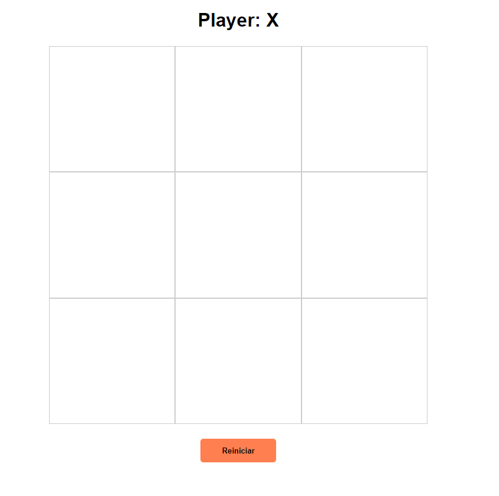
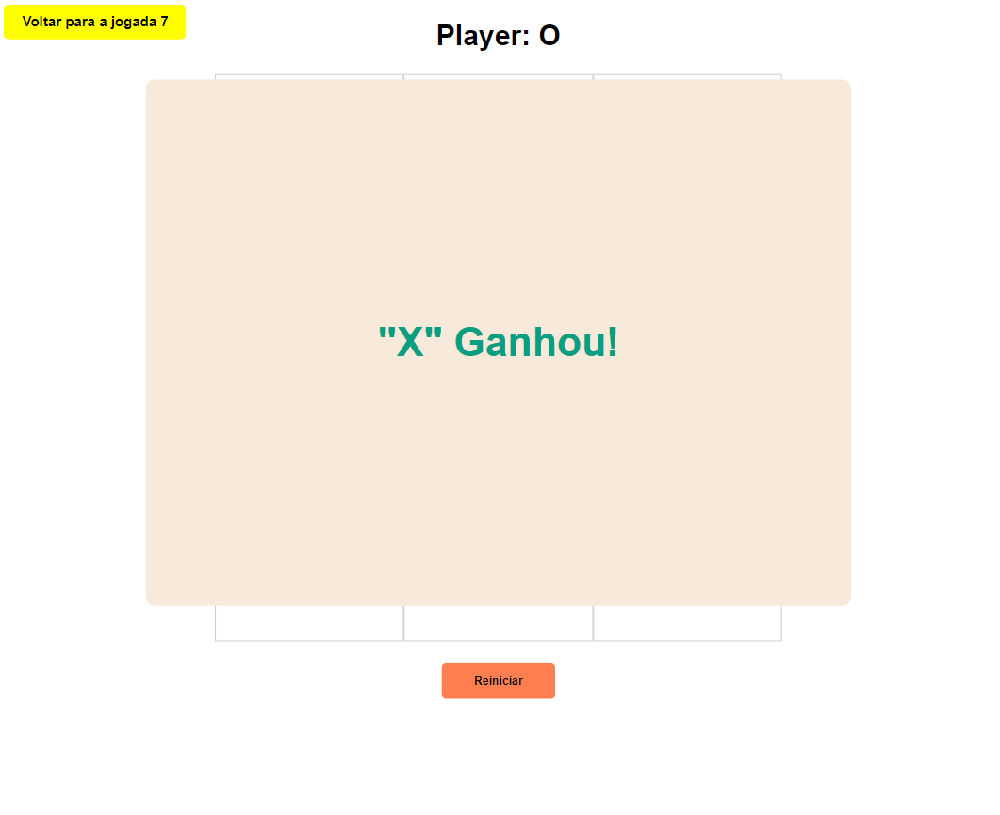

<h1>React Date</h1>

>projeto finalizado

<br>

<h3> O projeto em questão maipula datas, adcionando mais ou menos dias, meses ou anos.</h3>

<br>

acesse em: https://hash-game-two.vercel.app/


<hr>
<br>

<p>Tela principal: </p>



<p>Tela ganhador: </p>



<p>para rodar a aplicação: </p>

```
npm i

npm run dev
```
